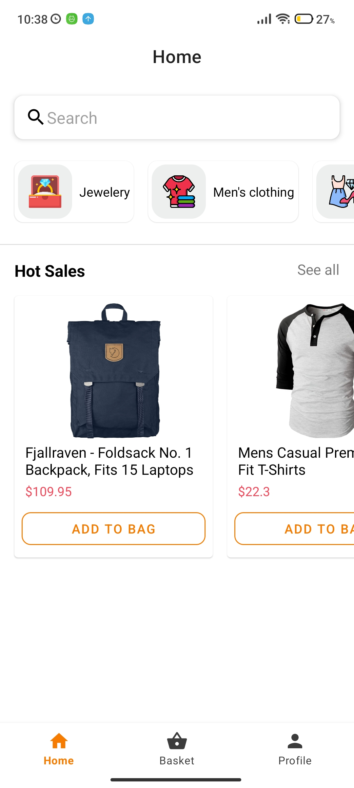
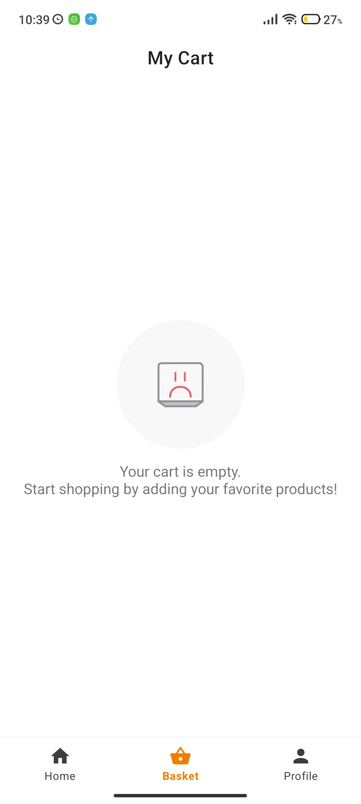
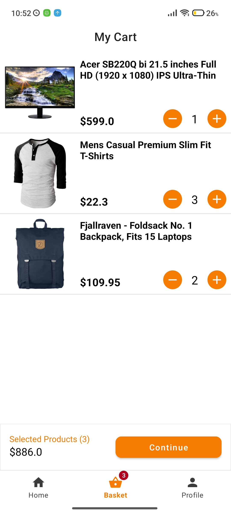
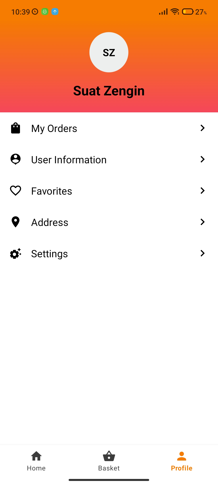

## FakeStore Andro is a fake e-commerce app 🔥

"FakeStore Andro" is a mock e-commerce mobile application using [Fake-store API](https://fakestoreapi.com/) designed for educational purposes. This repository contains an Android app created using Kotlin that simulates the functionality of an e-commerce platform. It is intended for developers to practice building and managing simple HTTP requests in an Android environment. The app allows users to view products, add them to their cart, [payment simulation](#payment-with-credit-card-animation) (click to watch video) and complete mock orders. It is a valuable resource for learning and honing Android development skills.

> _You can also check <a href="https://github.com/iamsuatzengin/fake-store-andro/tree/multi-module">multi-module version</a> this application. Click or change the branch._

## Screenshots

| Home          | Product List           | Product List By Category  | Product Detail       |
| ------------- |   :-------------:      | :-----:                   | :-------------:      |
|  </img>      |  </img> | </img> |  </img>      |

| Basket Empty           | Basket with items  |  Profile       | 
|:-------------:         | :-----:            | :-------------:|
|  </img> | </img> |  </img>      | 


### Tech Stack: 
* 100% [Kotlin](https://kotlinlang.org/)
* [Kotlin Coroutines](https://kotlinlang.org/docs/coroutines-overview.html)
* [Kotlin Flow](https://kotlinlang.org/docs/flow.html) - StateFlow - SharedFlow
* [ViewModel](https://developer.android.com/topic/libraries/architecture/viewmodel)
* [Jetpack Navigation](https://developer.android.com/guide/navigation) for navigatin between screens
* [Hilt](https://developer.android.com/training/dependency-injection/hilt-android) for Dependency Injection
* [Ktor Client](https://ktor.io/docs/create-client.html) for HTTP requests
* [Room database](https://developer.android.com/training/data-storage/room) for local database
* [Glide](https://github.com/bumptech/glide) is an image loading library
* [Lottie Animation](https://lottiefiles.com/)
* [Kotlinx.Serialization](https://github.com/Kotlin/kotlinx.serialization)
* [Parcelize](https://developer.android.com/kotlin/parcelize)
* [Version Catalog](https://developer.android.com/build/migrate-to-catalogs)
* [ViewBinding](https://developer.android.com/topic/libraries/view-binding)

### Custom Snackbar
This can be used in cases where a custom Snackbar is desired to display <b>a success message</b> for successful events, <b>an error message</b> for situations where an error message is desired, and <b>an information message</b> for scenarios where information needs to be conveyed. [Click to see all code.](https://github.com/iamsuatzengin/fake-store-andro/tree/master/app/src/main/java/com/example/fakestoreandro/ui/customview/snackbar)

 </img>  </img>  </img>

Simple usage:

```kt
// types -> SnackbomType.SUCCESS, SnackbomType.ERROR, SnackbomType.INFO
Snackbom.make(
    view = requireView(),
    text = "Error: ${state.errorMessage}",
    type = SnackbomType.ERROR
)
```

### Custom product count view with scaling animation
This custom view can be used to increase or decrease the product count in the basket. [Click to see all code.](https://github.com/iamsuatzengin/fake-store-andro/blob/master/app/src/main/java/com/example/fakestoreandro/ui/customview/ProductCountView.kt)

 </img>

Simple usage:

in XML:
```xml
<com.example.fakestoreandro.ui.customview.ProductCountView
        android:id="@+id/product_count_view"
        android:layout_width="wrap_content"
        android:layout_height="wrap_content"
        app:layout_constraintBottom_toBottomOf="parent"
        app:layout_constraintEnd_toEndOf="parent" />

```

With Kotlin code: 

```kt
productCountView.setItemCount(quantity = item.productQuantity)

productCountView.onAddButtonClickListener {
    callback.onAddClickListener(item)
}

productCountView.onRemoveButtonClickListener {
    callback.onRemoveClickListener(item)
}
```

## Payment with credit card animation
https://github.com/iamsuatzengin/fake-store-andro/assets/67907559/cd92794a-e906-41bf-960a-5a4bed93c8ee

